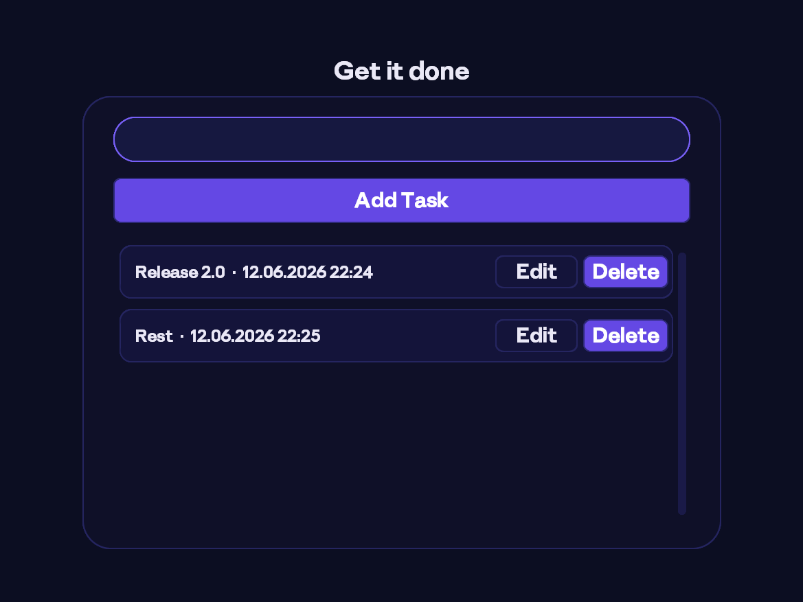
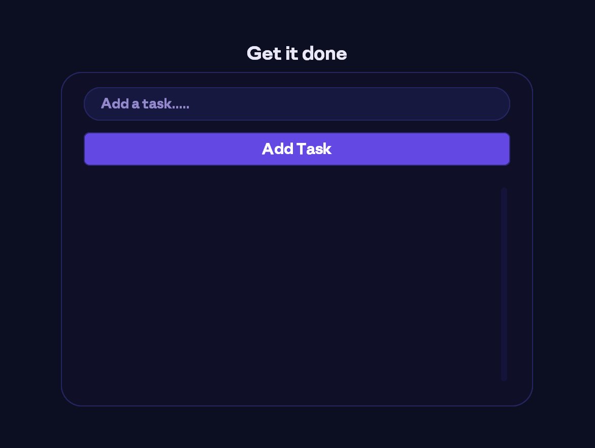

# GetItDone

## Overview
GetItDone is a sleek, custom‑tkinter based task manager that helps you track, edit, and delete your to‑do items. It uses the **Anthropic Sans** font family for a modern look and a Midnight Indigo theme.

## Screenshots

## Features
- Add, edit, and delete tasks
- Persistent storage in `tasks.json`
- Custom fonts loaded process‑private on Windows
- Responsive layout that fits an 800×600 window
- Clean, commented codebase

## Installation
- Install GetItDone.exe from 
- 
## Contributing
Feel free to open issues or submit pull requests. Keep the code style consistent and update documentation when adding features.

## License
This project is licensed under the MIT License.
